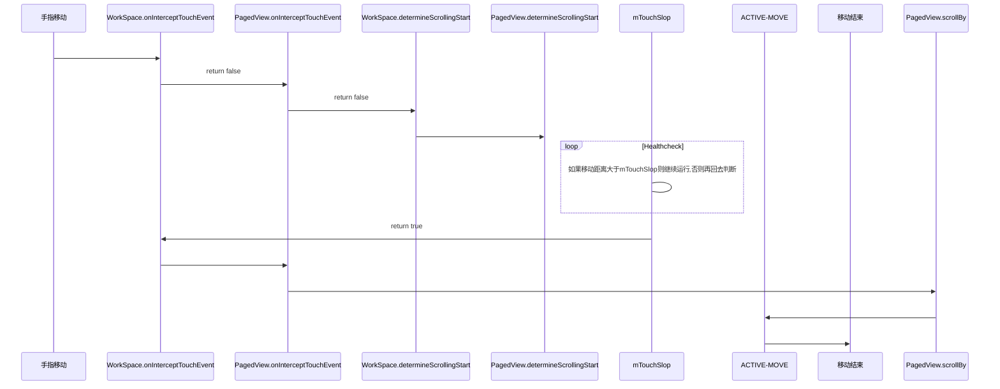
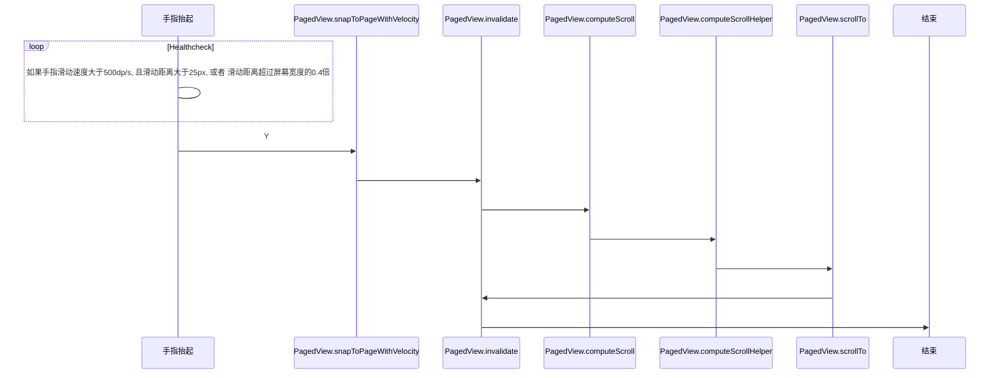

## 桌面滑动相关过程分析
### 1.Launcher3源码中相关类如下：
'''
1. Launcher.java: launcher主要的activity，是launcher桌面第一次启动的activity.
2. Workspace.java: 抽象的桌面。由N个cellLayout组成,从cellLayout更高一级的层面上对事件的处理。
3. PagedView.java: 是workspace的父类，用来桌面的左右滑屏
4. CellLayout.java： 组成workspace的view,继承自viewgroup，既是一个dragSource，又是一个dropTarget,可以将它里面的item拖出去，也可以容纳拖动过来的item。在workspace_screen里面定了一些它的view参数。
5. 其他相关类 解读中
6. LauncherProvider.java: launcher的数据库，里面存储了桌面的item的信息。在创建数据库的时候会loadFavorites(db)方法，loadFavorites()会解析xml目录下的default_workspace.xml文件，把其中的内容读出来写到数据库中，这样就做到了桌面的预制

'''
### 2. 滑动原理
Launcher桌面的整体布局大致如图


#### 手指在Launcher上滑动分为三个阶段：手指按下，手指滑动，手指离开
#### 2.1 手指按下-->WorkSpace.java : onInterceptTouchEvent
WorkSpace.java 
```java
@Override
public boolean onInterceptTouchEvent(MotionEvent ev) {
    switch (ev.getAction() & MotionEvent.ACTION_MASK) {
        case MotionEvent.ACTION_DOWN:
            mXDown = ev.getX();
            mYDown = ev.getY();
            mTouchDownTime = System.currentTimeMillis();
            break;
        case MotionEvent.ACTION_POINTER_UP:
        case MotionEvent.ACTION_UP:
            if (mTouchState == TOUCH_STATE_REST) {
                final CellLayout currentPage = (CellLayout) getChildAt(mCurrentPage);
                if (currentPage != null) {
                    onWallpaperTap(ev);
                }
            }
    }
    return super.onInterceptTouchEvent(ev);
}
```
PagedView.java 
```java
@Override
public boolean onInterceptTouchEvent(MotionEvent ev) {
    /*
     * This method JUST determines whether we want to intercept the motion.
     * If we return true, onTouchEvent will be called and we do the actual
     * scrolling there.
     */
    acquireVelocityTrackerAndAddMovement(ev);
    if (getChildCount() <= 0) return super.onInterceptTouchEvent(ev);
    /*
     * Shortcut the most recurring case: the user is in the dragging
     * state and he is moving his finger.  We want to intercept this
     * motion.
     */
    final int action = ev.getAction();
    if ((action == MotionEvent.ACTION_MOVE) && (mTouchState == TOUCH_STATE_SCROLLING)) {
        return true;
    }
    switch (action & MotionEvent.ACTION_MASK) {
        case MotionEvent.ACTION_MOVE: {
            /*
             * mIsBeingDragged == false, otherwise the shortcut would have caught it. Check
             * whether the user has moved far enough from his original down touch.
             */
            if (mActivePointerId != INVALID_POINTER) {
                determineScrollingStart(ev);
            }
            // if mActivePointerId is INVALID_POINTER, then we must have missed an ACTION_DOWN
            // event. in that case, treat the first occurence of a move event as a ACTION_DOWN
            // i.e. fall through to the next case (don't break)
            // (We sometimes miss ACTION_DOWN events in Workspace because it ignores all events
            // while it's small- this was causing a crash before we checked for INVALID_POINTER)
            break;
        }
        case MotionEvent.ACTION_DOWN: {
            final float x = ev.getX();
            final float y = ev.getY();
            // Remember location of down touch
            mDownMotionX = x;
            mDownMotionY = y;
            mDownScrollX = getScrollX();
            mLastMotionX = x;
            mLastMotionY = y;
            float[] p = mapPointFromViewToParent(this, x, y);
            mParentDownMotionX = p[0];
            mParentDownMotionY = p[1];
            mLastMotionXRemainder = 0;
            mTotalMotionX = 0;
            mActivePointerId = ev.getPointerId(0);
            /*
             * If being flinged and user touches the screen, initiate drag;
             * otherwise don't.  mScroller.isFinished should be false when
             * being flinged.
             */
            final int xDist = Math.abs(mScroller.getFinalX() - mScroller.getCurrX());
            final boolean finishedScrolling = (mScroller.isFinished() || xDist < mTouchSlop / 3);
            if (finishedScrolling) {
                mTouchState = TOUCH_STATE_REST;
                if (!mScroller.isFinished() && !mFreeScroll) {
                    setCurrentPage(getNextPage());
                    pageEndTransition();
                }
            } else {
                if (isTouchPointInViewportWithBuffer((int) mDownMotionX, (int) mDownMotionY)) {
                    mTouchState = TOUCH_STATE_SCROLLING;
                } else {
                    mTouchState = TOUCH_STATE_REST;
                }
            }
            break;
        }
        case MotionEvent.ACTION_UP:
        case MotionEvent.ACTION_CANCEL:
            resetTouchState();
            break;
        case MotionEvent.ACTION_POINTER_UP:
            onSecondaryPointerUp(ev);
            releaseVelocityTracker();
            break;
    }
    cancelPageMoving();    //ww+
    /*
     * The only time we want to intercept motion events is if we are in the
     * drag mode.
     */
    return mTouchState != TOUCH_STATE_REST;
}
```
CellLayout.java 
```java
@Override
public boolean onInterceptTouchEvent(MotionEvent ev) {
    if (mUseTouchHelper || (mInterceptTouchListener != null && mInterceptTouchListener.onTouch(this, ev))) {
        return true;
    }
    return false;
}
@Override
public boolean onTouchEvent(MotionEvent ev) {
    boolean handled = super.onTouchEvent(ev);
    // Stylus button press on a home screen should not switch between overview mode and
    // the home screen mode, however, once in overview mode stylus button press should be
    // enabled to allow rearranging the different home screens. So check what mode
    // the workspace is in, and only perform stylus button presses while in overview mode.
    if (mLauncher.mWorkspace.isInOverviewMode() && mStylusEventHelper.onMotionEvent(ev)) {
        return true;
    }
    return handled;
}
```
### 手指移动
当手指按下时，还没有准备滚动，此时mTouchState = TOUCH_STATE_REST, 前面几个方法都return 了 false

决定屏幕开始滑动的阈值计算：
```java
mTouchSlop = configuration.getScaledPagingTouchSlop()
mTouchSlop = res.getDimensionPixelSize(
            com.android.internal.R.dimen.config_viewConfigurationTouchSlop)*2;
```
常量定义在文件 SDK/platforms/android-34/data/res/values/config.xml中<dimen name="config_viewConfigurationTouchSlop">8dp</dimen>。 故mTouchSlop = 8dp * 2 = 16dp，这是系统默认值。
当手指移动距离>mTouchSlop时，Wokespace开始拦截ACTION_MOVE事件，并调用scrollBy(),这是整个过程第一次屏幕移动。每收到一次ACTION_MOVE事件，并执行scrollBy()事件，直到用户手指离开屏幕。scrollBy()事件最终调用的是View.scrollTo()来进行屏幕的滚动操作
scrollTo(x,y)
```java
@Override
public void scrollTo(int x, int y) {
    // In free scroll mode, we clamp the scrollX
    if (mFreeScroll) {
        // If the scroller is trying to move to a location beyond the maximum allowed
        // in the free scroll mode, we make sure to end the scroll operation.
        if (!mScroller.isFinished() && (x > mFreeScrollMaxScrollX || x < mFreeScrollMinScrollX)) {
            forceFinishScroller(false);
        }
        x = Math.min(x, mFreeScrollMaxScrollX);
        x = Math.max(x, mFreeScrollMinScrollX);
    }
    boolean isXBeforeFirstPage = mIsRtl ? (x > mMaxScrollX) : (x < 0);
    boolean isXAfterLastPage = mIsRtl ? (x < 0) : (x > mMaxScrollX);
    if (isXBeforeFirstPage) {
        super.scrollTo(mIsRtl ? mMaxScrollX : 0, y);
        if (mAllowOverScroll) {
            mWasInOverscroll = true;
            if (mIsRtl) {
                overScroll(x - mMaxScrollX);
            } else {
                overScroll(x);
            }
        }
    } else if (isXAfterLastPage) {
        super.scrollTo(mIsRtl ? 0 : mMaxScrollX, y);
        if (mAllowOverScroll) {
            mWasInOverscroll = true;
            if (mIsRtl) {
                overScroll(x);
            } else {
                overScroll(x - mMaxScrollX);
            }
        }
    } else {
        if (mWasInOverscroll) {
            overScroll(0);
            mWasInOverscroll = false;
        }
        mOverScrollX = x;
        super.scrollTo(x, y);
    }
    // Update the last motion events when scrolling
    if (isReordering(true)) {
        float[] p = mapPointFromParentToView(this, mParentDownMotionX, mParentDownMotionY);
        mLastMotionX = p[0];
        mLastMotionY = p[1];
        updateDragViewTranslationDuringDrag();
    }
}
```
### 手指离开

#### 达到下面两种情况之一，都可以触发launcher滑屏事件:
   当滑动距离超过屏幕宽度的0.4倍,SIGNIFICANT_MOVE_THRESHOLD = 0.4
```java
boolean isSignificantMove = Math.abs(deltaX) > pageWidth * SIGNIFICANT_MOVE_THRESHOLD;
```
   当速度大于500dp/s, 且滑动距离大于 25px
```java
boolean isFling = mTotalMotionX > MIN_LENGTH_FOR_FLING &&  Math.abs(velocityX) > mFlingThresholdVelocity;
```


